

> ### ⚠️ 这是 Animeko 的一个**非官方本地修改版**，不是官方仓库
>
> 本仓库基于 [open-ani/animeko](https://github.com/open-ani/animeko) 的提交
> `28ec14aca0a2b001f2ce1f6dd1b68acd44a14f67`，新增了本地弹幕剧透过滤功能。
> **请勿将本仓库的问题反馈给 Animeko 官方。**
> 项目说明、当前状态与边界请看 **[ANIMEKOLOCALGUARD.md](ANIMEKOLOCALGUARD.md)**。
>
> 下面的内容来自上游 README，描述的是 Animeko 本身。

| 正式版                                                                                                                                                                          | 测试版                                                                                                                                                                                     | 讨论群                                                                                                                                                                                                                                                                                                                                                                                                           |
|------------------------------------------------------------------------------------------------------------------------------------------------------------------------------|-----------------------------------------------------------------------------------------------------------------------------------------------------------------------------------------|---------------------------------------------------------------------------------------------------------------------------------------------------------------------------------------------------------------------------------------------------------------------------------------------------------------------------------------------------------------------------------------------------------------|
|  |  |  |

[dmhy]: http://www.dmhy.org/

[Bangumi]: http://bangumi.tv

[ddplay]: https://www.dandanplay.com/

[Compose Multiplatform]: https://www.jetbrains.com/compose-multiplatform/

[acg.rip]: https://acg.rip

[Mikan]: https://mikanani.me/

[Ikaros]: https://ikaros.run/

[Kotlin Multiplatform]: https://kotlinlang.org/docs/multiplatform.html

[ExoPlayer]: https://developer.android.com/media/media3/exoplayer

[VLC]: https://www.videolan.org/vlc/

[libtorrent]: https://libtorrent.org/

Animeko 支持云同步观看记录 ([Bangumi][Bangumi])、多视频数据源、缓存、弹幕、以及更多功能，提供尽可能简单且舒适的追番体验。

> Animeko 曾用名 Ani，现在也简称 Ani。

[立即下载](https://animeko.org/)

https://github.com/user-attachments/assets/e63636c9-30b7-411c-aa6b-e5b78b900726

## 主要功能

### 浏览来自 [Bangumi][Bangumi] 的番剧信息以及社区评价

| 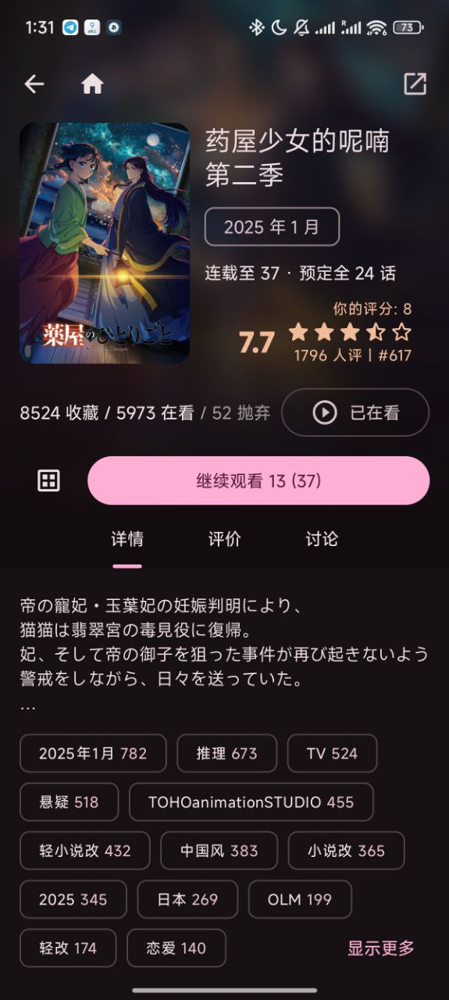 | 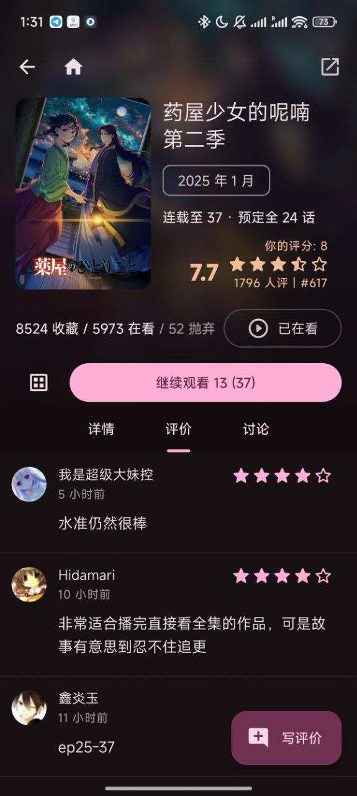 | 
|:---------------------------------------------------------------------------:|:--------------------------------------------------------------------------:|

### 丰富的检索方式：新番时间表、标签搜索

> 由 Bangumi 和 Animeko 服务端共同提供的精确新番时间表

| 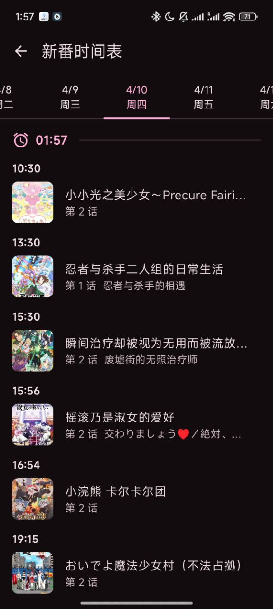 | 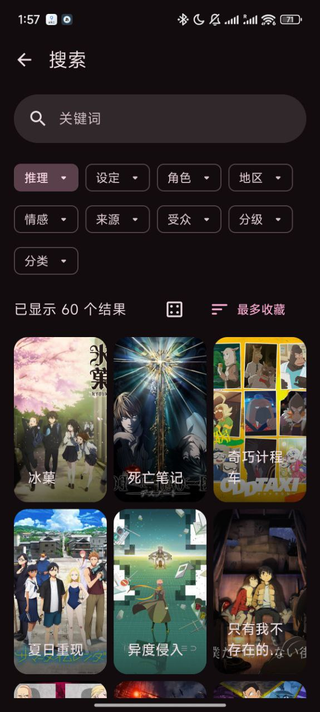 | 
|:--------------------------------------------------------------------------:|:-------------------------------------------------------------------------:|

### 云同步追番进度

- 省心的追番进度管理，看完视频自动更新进度
- 打开 APP 立即继续观看，无需回想上次看到了哪

| 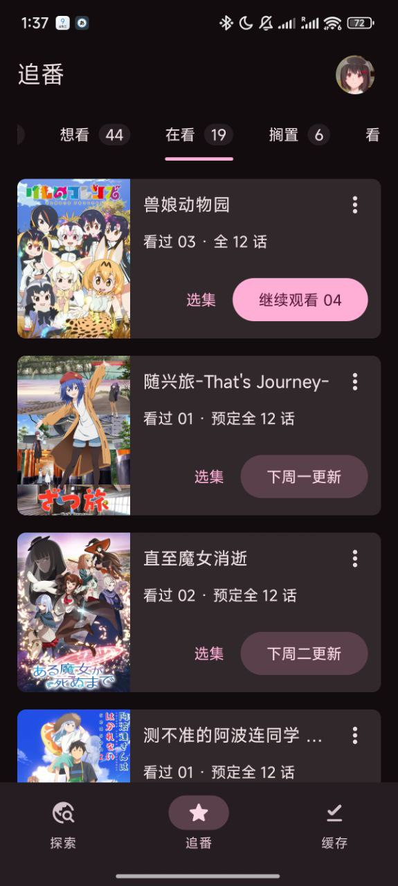 | 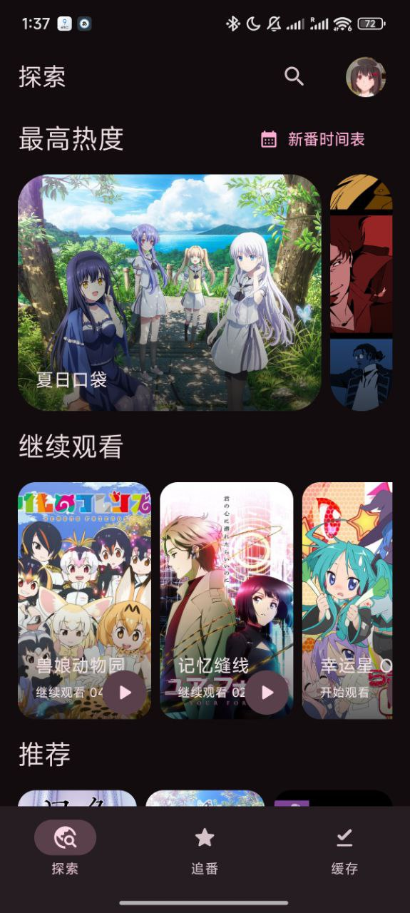 | 
|:------------------------------------------------------------------------------:|:----------------------------------------------------------------:|

### 聚合数据源

- [聚合视频数据源](https://github.com/creamycake-anime/ani-subs)，全自动选择
  > 还支持 BitTorrent、Jellyfin、Emby、以及自定义源
- 聚合全网弹幕源（[弹弹play][ddplay]），以及 Animeko 自己的[弹幕服务](https://danmaku-cn.myani.org/swagger/index.html)

| 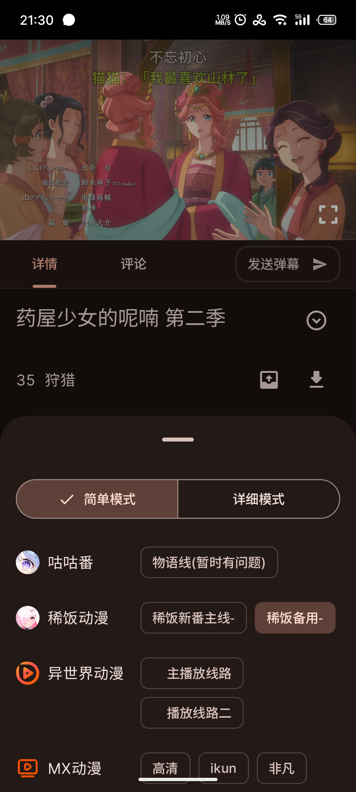 | 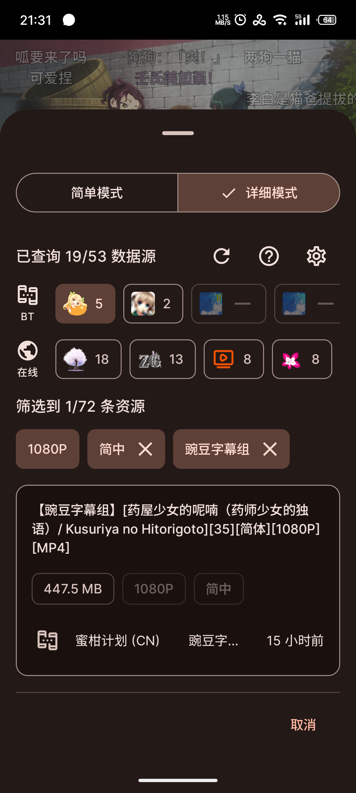 |
|:--------------------------------------------------------------------------------:|:----------------------------------------------------------------------------------:|

| 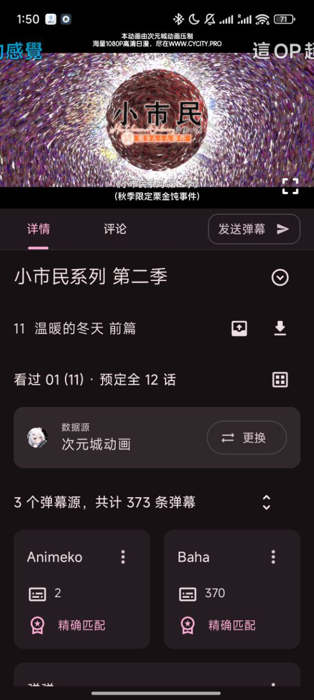 | 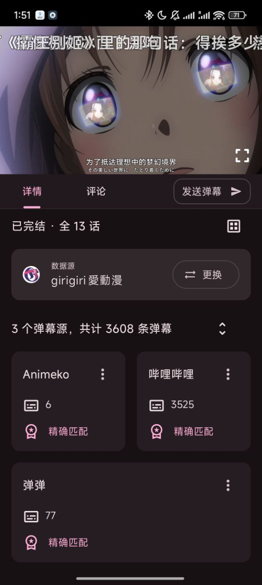 |
|:-------------------------------------------------------------------:|:----------------------------------------------------------------------------:|

### 离线缓存

- 所有数据源都能缓存

| 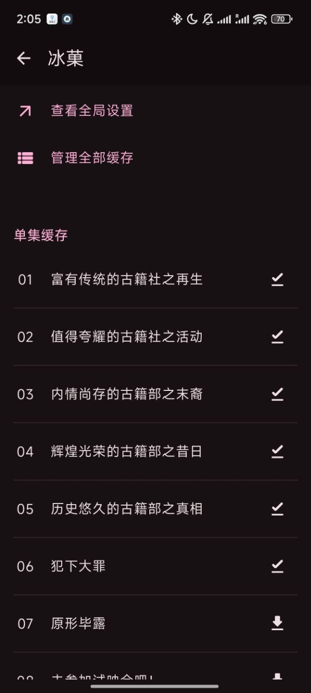 | 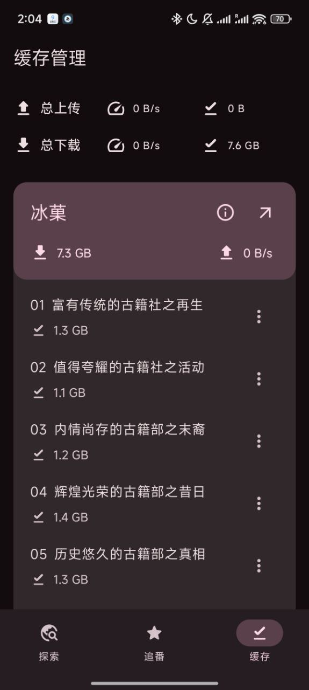 |
|:-------------------------------------------------------------------------:|:----------------------------------------------------------------------:|

### 精美界面

| 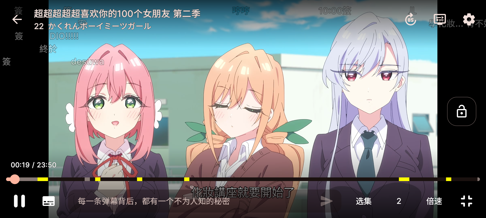 |
|:-----------------------------------------------------------------------------:|

- 适配平板和大屏设备

| 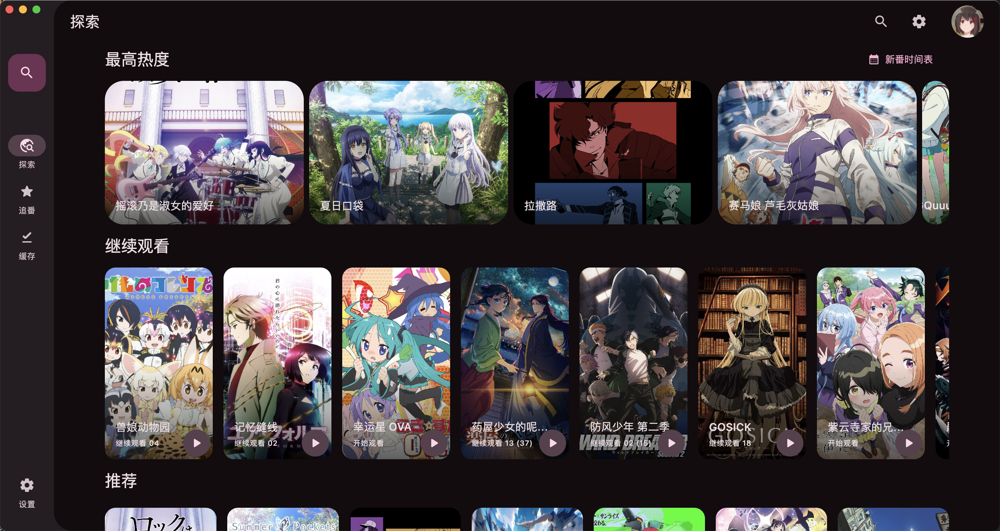 |
|:-------------------------------------------------------------------:|

| 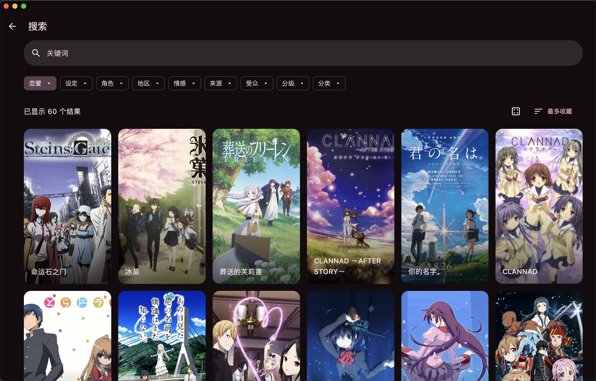 |
|:---------------------------------------------------------------------:|

| 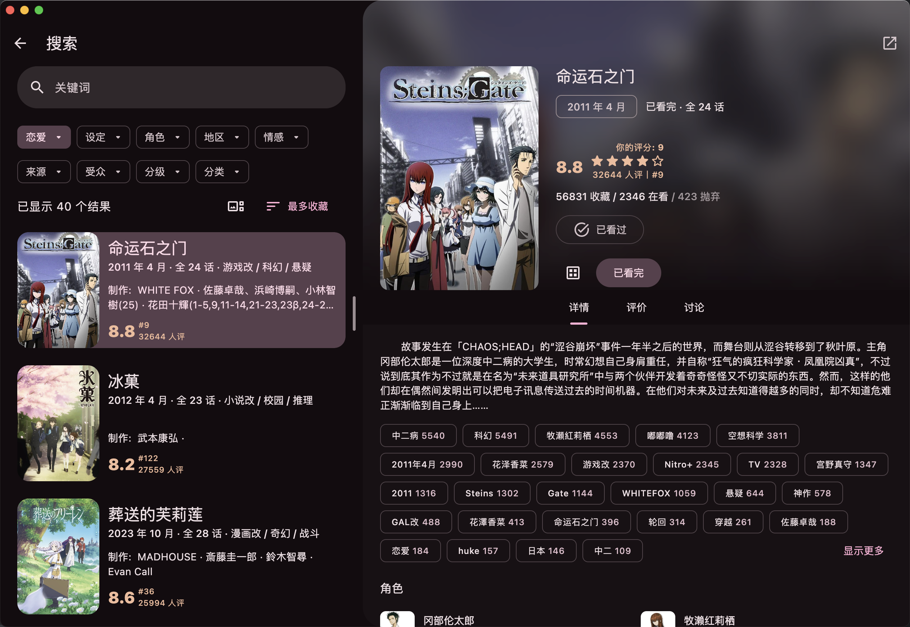 |
|:----------------------------------------------------------------------------:|

### 更多个性设置

| 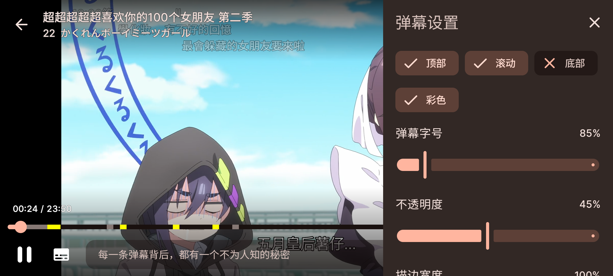 |
|:----------------------------------------------------------------------------:|

| 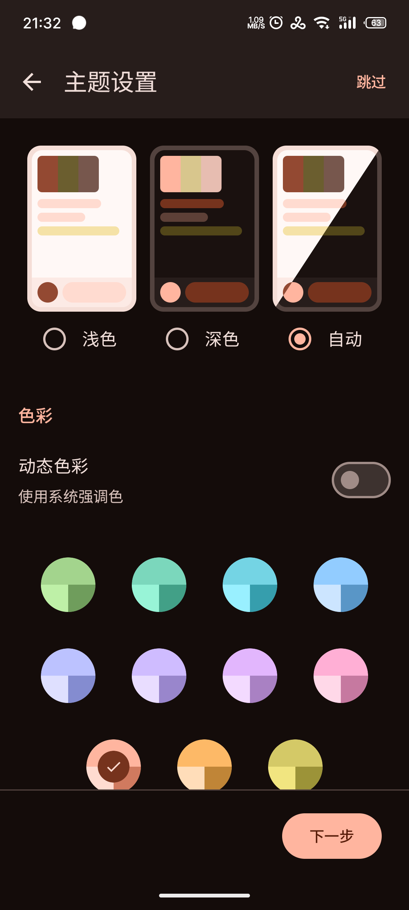 | 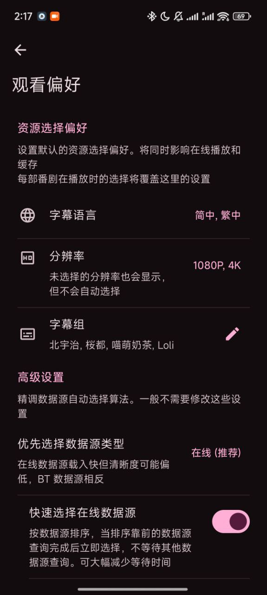 |
|:--------------------------------------------------------------------------:|:-----------------------------------------------------------------------------:|

## 下载

Animeko 支持所有主流平台：Android、iOS、Windows、macOS、Linux。

- 稳定版本: 功能稳定  
  [下载稳定版本](https://animeko.org/downloads/)

通常建议使用稳定版本. 如果你愿意参与测试并拥有一定的对 bug 的处理能力, 也欢迎使用测试版本更快体验新功能.
具体版本类型可查看下方.

- 测试版本: 体验最新功能  
  [下载测试版本](https://animeko.org/downloads/)

## 技术总览

如果你是开发者，我们总是欢迎你提交 PR 参与开发！
以下几点可以给你一个技术上的大概了解。

- [Kotlin 多平台][Kotlin Multiplatform]架构；
- 使用新一代响应式 UI 框架 [Compose Multiplatform][Compose Multiplatform] 构建
  UI；
- 内置专为 Animeko 打造的“基于 [libtorrent][libtorrent] 的 BitTorrent 引擎，优化边下边播的体验；
- 高性能弹幕引擎，公益弹幕服务器 + 网络弹幕源；
- 适配多平台的[视频播放器](https://github.com/open-ani/mediamp)，Android 底层为 [ExoPlayer][ExoPlayer]，PC 底层为 [VLC][VLC]；
- 多类型数据源适配，内置 [动漫花园][dmhy]、[Mikan]，拥有强大的自定义数据源编辑器和自动数据源选择器。

### 参与开发

欢迎你提交 PR 参与开发，
有关项目技术细节请参考 [CONTRIBUTING](docs/contributing/README.md)。

## FAQ

### 资源来源是什么?

全部视频数据都来自网络, Animeko 本身不存储任何视频数据。
Animeko 支持两大数据源类型：BT 和在线。BT 源即为公共 BitTorrent P2P 网络，
每个在 BT
网络上的人都可分享自己拥有的资源供他人下载。在线源即为其他视频资源网站分享的内容，目前使用 [creamycake ani-subs](https://github.com/creamycake-anime/ani-subs)。Animeko
本身并不提供任何视频资源。

本着互助精神，使用 BT 源时 Animeko 会自动做种 (分享数据)。
BT 指纹为 `-AL4123-`，其中 `4123` 为版本号 `4.12.3`；UA 为类似 `ani_libtorrent/4.12.3`。

### 弹幕来源是什么?

Animeko 拥有自己的公益弹幕服务器，在 Animeko 应用内发送的弹幕将会发送到弹幕服务器上。每条弹幕都会以
Bangumi
用户名绑定以防滥用（并考虑未来增加举报和屏蔽功能）。

Animeko 还会从[弹弹play][ddplay]获取关联弹幕，弹弹play还会从其他弹幕平台例如哔哩哔哩港澳台和巴哈姆特获取弹幕。
番剧每集可拥有几十到几千条不等的弹幕量。
