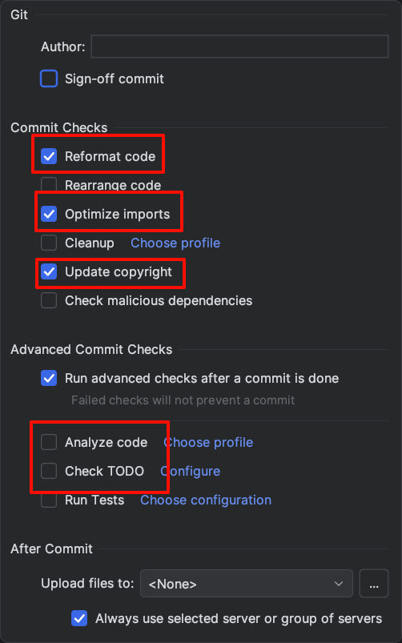

# 代码风格与代码规范

## 格式化

项目内提供 `.editorconfig` 确保统一格式。

建议在 IDE 的 Commit 页面，点击右下角设置，按如图所示配置。
在提交时将会自动格式化代码并更新 copyright 年份。

> [!IMPORTANT]
> 确保 IDE 设置中 `Editor -> Code Style -> Enable EditorConfig support` 是勾选的。

## 代码规范参考

- [Kotlin 官方代码风格指南](https://kotlinlang.org/docs/coding-conventions.html)
- 请为新功能增加单元测试!
- Google [The Standard of Code Review](https://google.github.io/eng-practices/review/reviewer/standard.html)

### PR Review 惯例

审核者会尽其所能提供 PR 反馈。一个 PR 可能会收到几个到数十个评论，这些评论可能是必须修改的问题，也可能是一些轻微的建议。

- "nit: " 表示一个轻微问题，这表示当前的代码是可以接受的，不过有一个更好的写法，下次可以这么做。开发者可以直接忽略这些评论 (
  点击 "
  Resolve Conversation") 以节约时间。

对于其他评论，通常的解决规则是：

- 按照评论内容修改代码，commit，然后 push。如果你比较确定这个修改是正确的，直接点击 "Resolve Conversation"
  。如果不确定，可以在评论中回复 "done"，提醒审核者仍需关注这个评论。
- 在任何时候回复评论后都不要点击 "Resolve Conversation"，否则可能会导致审核者错过回复。
