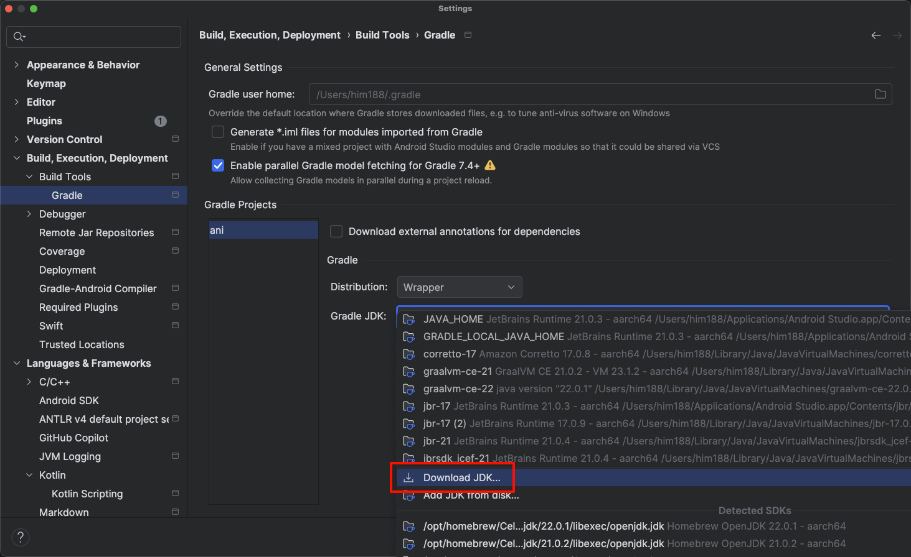
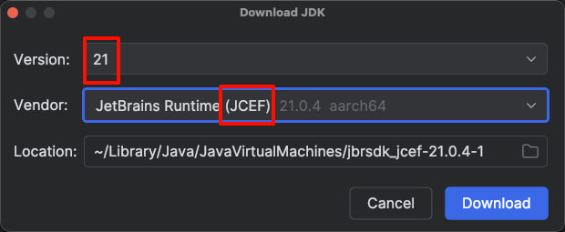

# 开发工具和环境

> [!IMPORTANT]
> 这些步骤只需要几分钟即可完成，请不要跳过。跳过可能会导致花费更多时间解决问题。

## 主流程

Animeko 使用 Gradle 构建，就是通常的 Kotlin/Android 构建方式。如果你熟悉，可以直接 clone 导入项目就行。但是要注意必须使用 JetBrains Runtime JDK (附带 JCEF 的版本)，版本必须为 21，否则会无法构建桌面端。可以参考下文[教程](#无法构建桌面端-jdk-不兼容--找不到-cef-相关类)。

若你不熟悉 Kotlin/Android 开发，可以参考以下步骤：

1. [准备 IDE](#准备-ide)
2. [配置 Android SDK](#配置-android-sdk)
3. [Clone 仓库](#clone-仓库)
4. 导入项目并等待第一次同步完成

> [!TIP]
> **默认会使用以下配置**
>
> - JDK 会由 Gradle 自动下载并使用正确的 JBR 21
> - Android 默认只构建 `arm64-v8a`
> - iOS 默认关闭
>
> 只有在你确实遇到问题，或者要开发 iOS / 改 ABI 时，再看文档后半部分的 [按需配置](#按需配置默认不用先读)

## 准备 IDE

使用最新的正式版 Android Studio (AS) 或者 IntelliJ IDEA 即可。

## 配置 Android SDK

1. 打开 SDK Manager
    - Android Studio 中为 Tools -> SDK Manager
    - IntelliJ 中 Tools -> Android -> SDK Manager
2. 安装 SDK 版本 36 或以上

## Clone 仓库

建议使用 IDE clone 功能. 如果你要自己使用命令行 clone, 必须添加 `--recursive`:

```shell
git clone --recursive git@github.com:open-ani/animeko.git
# or 
git clone --recursive https://github.com/open-ani/animeko.git
```

> [!WARNING]
> **Windows 特别提示**
>
> 建议在 clone 项目后立即设置 Git 使用 LF 并忽略文件权限。
>
>   ```shell
>   git config core.autocrlf false
>   git config core.eol lf
>   git config core.filemode false
>   ```

Clone 后第一次导入项目可能需要 30 分钟下载依赖。

## 问题排查

下面这些内容只在以上流程不工作时才需要。

### 无法构建桌面端 (JDK 不兼容 / 找不到 CEF 相关类)

由于 PC 端使用 [JCEF](https://github.com/jetbrains/jcef) (内置浏览器)，JDK 必须使用 JetBrains
Runtime (附带 JCEF 的版本)，版本必须为 21，下文简称 JBR。

可以自行安装 JBR。在 Android Studio 或 IntelliJ IDEA 中，可打开设置
`Build, Execution, Deployment -> Build Tools -> Gradle`，将 Gradle JDK 改为 JBR (JCEF) 21。




### 构建 iOS（仅 macOS）

默认情况下，仓库不会启用 iOS 编译目标，也不会构建 framework。只有在你确实要运行或打包 iOS APP 时，才需要做这一节。

先在项目根目录的 `local.properties`（如果没有就创建一个）中加入：

```properties
ani.enable.ios=true
ani.build.framework=true
```

然后再安装 iOS 依赖：

1. 在 App Store 中安装 Xcode 并打开，安装默认勾选的必要的组件。
2. 安装 Cocoapods。有多种安装方式，参考 Kotlin
   官方文档 [CocoaPods](https://kotlinlang.org/docs/native-cocoapods.html#set-up-an-environment-to-work-with-cocoapods)。

### 切换安卓 ABI

默认配置是只构建 `arm64-v8a`，这是大多数真机开发最省时的配置。你可以用如下配置切换架构：

```properties
# 默认值，不写也一样
ani.android.abis=arm64-v8a

# 如果你要给 x86_64 模拟器跑
ani.android.abis=x86_64

# 如果你需要完整产物
ani.android.abis=all
```
